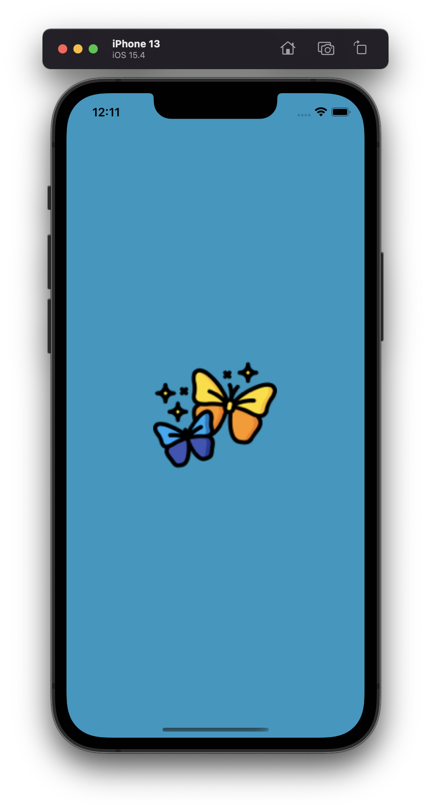
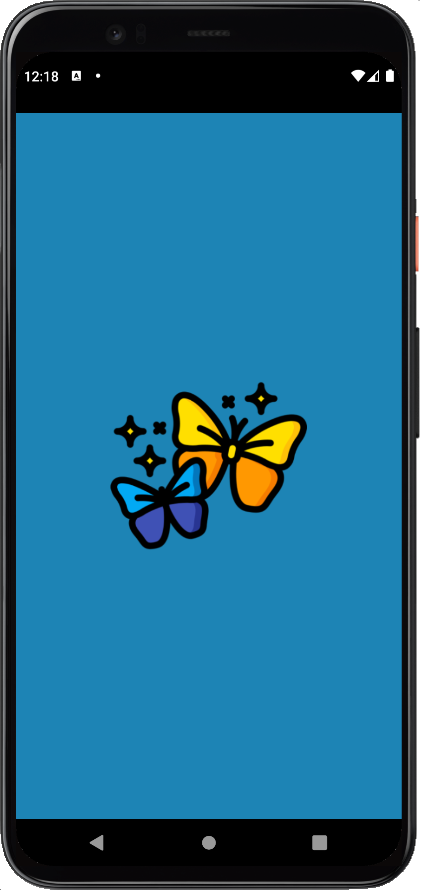
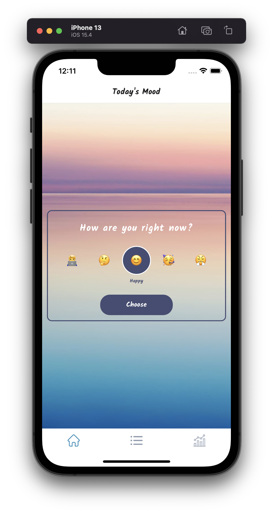
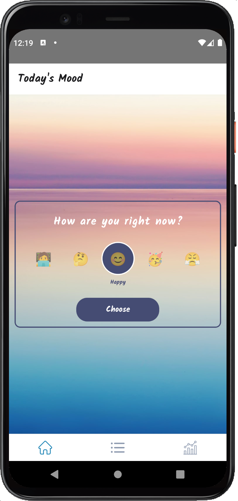
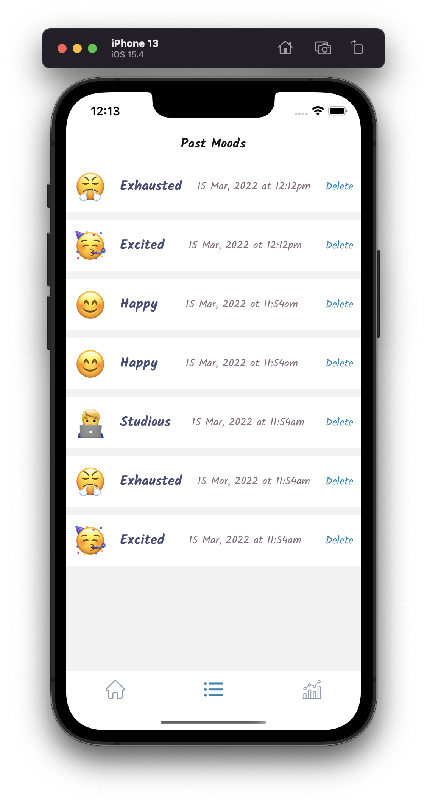
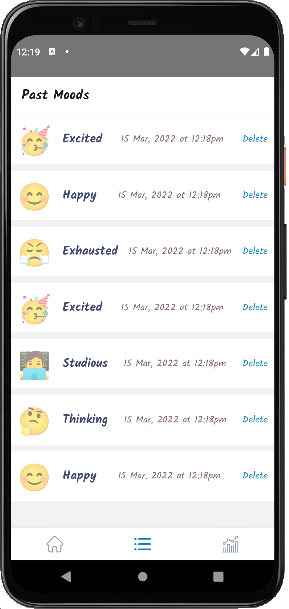
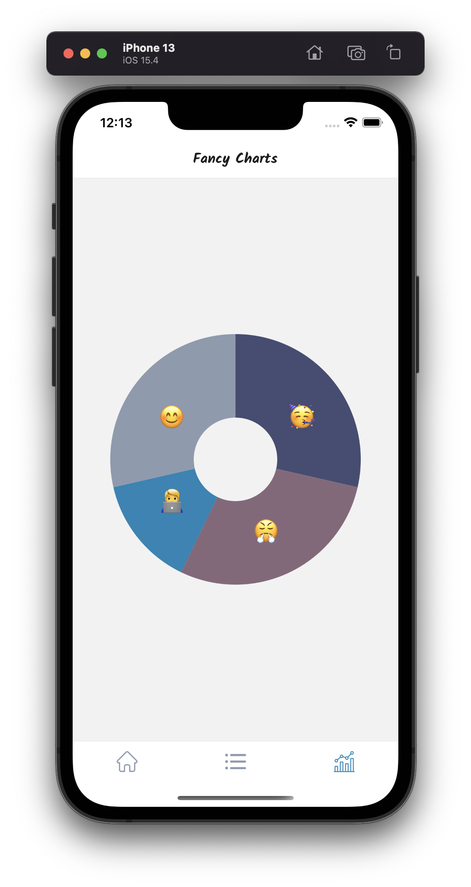
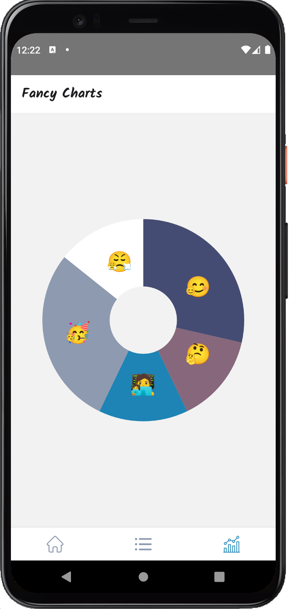

<p align="center">
<a href="https://github.com/mitulsavani/Mood">

</a>
</p>

<h1 align="center">
Mood
</h1>
<p align="center">
A simple app that helps you to track and store metrics of your mood
</p>

<br>

## Getting Started - Run Locally

```
git clone https://github.com/mitulsavani/Mood.git

yarn install

yarn start

yarn run ios (iOS version)

yarn run android (Android version)
```

## Motivation / The Purpose

- TypeScript with React Native
- Recap on core components and React Hooks
- Bottom Navigation
- JavaScript-only vs native libraries for React Native
- Using React Context to store global app state
- Persisting data across app launches
- Rendering images locally and via url
- SVG's in React Native
- Adding custom fonts
- Animations using LayoutAnimation
- Bespoke animations using Reanimated
- Adding app icons
- Adding a splash screen
- Data visualization using victory native

## Screens

|                       iOS                                  |                              Android                           |
| :-----------------------------------------------------: | :-----------------------------------------------------: |
|  |  |
|  |  |
|  |  |
|  |  |


> Thank you from Mitul, updated on 03/15/22.